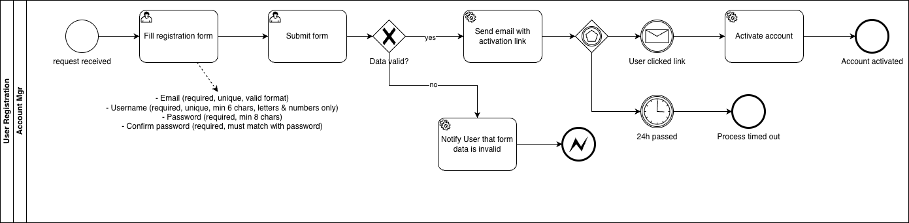
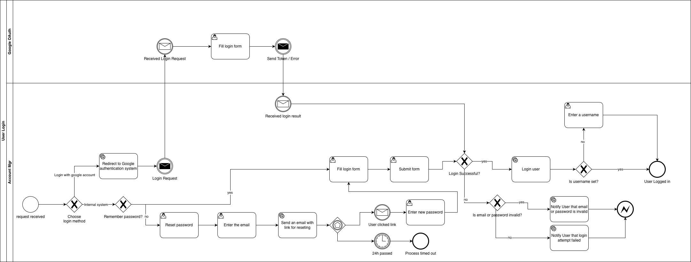

# Business Processes (BPMN)

## BP-001 — User Registration

### Description:
Process in which a new user creates an account in the system.

### Trigger:
Clicking the **Create Account** button on the Login page.

### Diagram

## BP-002 — User Login

### Description:
Process in which an user authenticates to the system.

### Trigger:
Using the login panel (entering email/password) or clicking **Continue with Google**.

### Diagram

